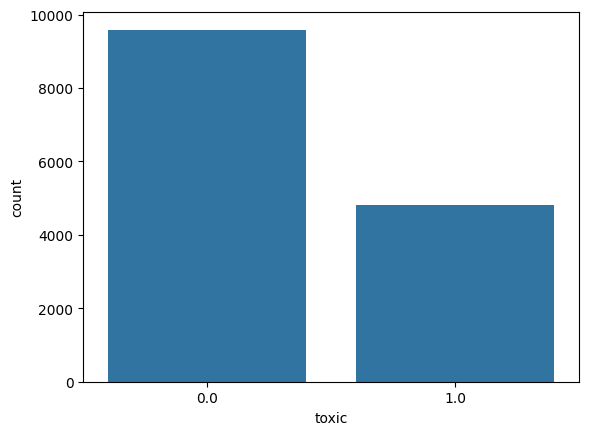
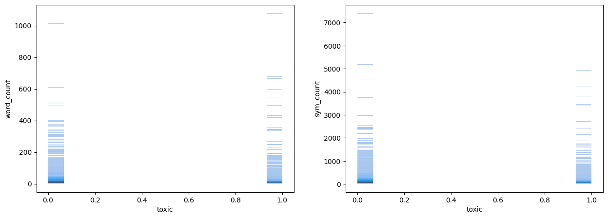

# russian-toxic-comments-classification

### Цель проекта
Построить модель для классификации токсичности текста (комментария) на русском языке.

### Данные
Проект выполнен на основе датасета [Kaggle: Russsian Toxic Comments](https://www.kaggle.com/datasets/blackmoon/russian-language-toxic-comments). Датасет состоит из 14412 размеченных комментариев на русском языке

### Стек
- Python
- Pandas
- Scikit-learn
- Imblearn
- Matplotlib
- Seaborn
- joblib
- torch
- nltk
- pymorphy22

### Структура репозитория
- data - хранение csv файлов
- model - сохранённые модели
- notebooks - исследование данных, построение моделей
- src - скрипты

### Инструкция по запуску
1) ```pip install -r requirements.txt```
2) Запустить препроцессинг данных: ```py3hon src/process.py```.
3) Запустить создание и обучение модели:```python src/train.py```.
4) Запустить создание предсказания: ```python src/predict.py```. Опции: ```--input data_file_name.csv``` - выбор файла для загрузки в модель, ```--output data_file_name.csv``` - указание расположения файла для предсказаний.

### Методология
1) EDA - разведочный анализ датасета на пропущенные значения, распределение целевой переменной, самые частые слова для каждой метки.
2) Подбор baseline моделей и векторизаторов.
3) Подбор гиперпараметров для baseline моделей и векторизаторов при помощи RandomizedSearchCV, показавших наилучшие результаты "из коробки".
4) Написание нейросетевых решений: с нуля, fine-tuning BERT

### Результаты
#### Результаты исследования данных
В ходе исследования было найдено распределение целевой переменной:



Зависимость целевой переменной от количества символо/слов:



Был создан функционал для обработки и токенизации текста. Были выявлены самые частые слова для каждого значения целевой переменной.

#### Результаты исследования baseline моделей
В качестве базовых моделей были выбраны: 
- Logistic Regression 
- Multinominal Naive Bayess

Качественный анализ базовых моделей:
| Model | Vectorizer | Accuracy | F1 | Recall | Precision |
| :---: | :---: | :---: | :---: | :---: | :---: |
| Logistic Regression| Count Vectorizer | 0.872 | 0.8 | 0.794 | 0.806 |
| Logistic Regression| TF-IDF | 0.888 | 0.813 | 0.752 | 0.883 |
| Multinominal Naive Bayess | Count Vectorizer | 0.867 | 0.806 | 0.864 | 0.756 |
| Multinominal Naive Bayess | TF-IDF | 0.867 | 0.806 | 0.864 | 0.756 |

#### Подбор гиперпараметров
Для дальнейшего исследования были выбрани следующие модели и векторизаторы:
- Logistic Regression + TF-IDF
- Multinominal Naive Bayess + Count Vectorizer

После проведения анализа гиперпараметров выбранных моделей получены следующие результаты:
| Model | Vectorizer | Accuracy | F1 | Recall | Precision |
| :---: | :---: | :---: | :---: | :---: |
| Logistic Regression| TF-IDF | 0.998 | 0.997 | 0.998 | 0.997 |
| Multinominal Naive Bayess | Count Vectorizer | 0.925 | 0.886 | 0.912 | 0.863 |

По результатам анализа были выбраны Logistic Regression + TF-IDF со следующими гиперпараметрами:

TF-IDF:
- min_df: 5
- max_features: None
- max_df: 1
- ngram_range: (1, 3)

Logistic Regression:
- C: 100
- class_weight: None
- penalty: l2
- solver: liblinear

Confuzion Matrix для полученной модели:


### Нейросетевые решения:
Для решения задачи было выбрано 2 нейросетевых решения:
- Кастомный классификатор с обработкой текстов через LSTM
- Fine-Tuned BERT

Модели показали следующие результаты:
| Model | Accuracy | F1 | Recall | Precision |
| :---: | :---: | :---: | :---: |
| Custom NN | --- | --- | --- | --- |
| Fine Tuned BERT | --- | --- | --- | --- |

### Итоги и выводы
Основываясь на проведённом исследовании, можно заметить, что тональность текста в подовляющем большинстве случаев можно определить с замечательной точностью, основываясь на конкретных словах. Это доказывает сильное проседание в качестве предсказаний у нейросетевых решений, которые основываются на локальном контексте.

### Автор
Романов Илья
